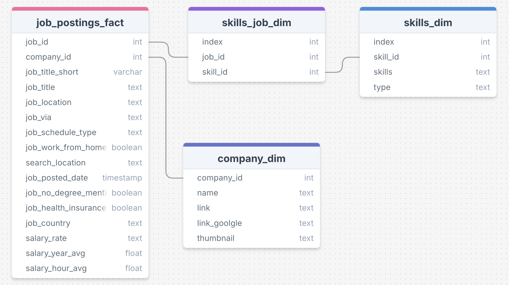

# Project Motivation
This project was designed to teach me the basics of setting up a database, using SQL queries to accsess it, and how to format the results from those queries.

I learned how to manipulate datasets to return the results I wanted and I also learned how to join together multiple datasets to display different information across  different data sets.

# Project Overview
This project takes a deeper look at job postings for data analyst roles across the globe in 2023. Using four different datasets that contain information about the job postings, the project focused on trying to find the best jobs in the data analyst world and also the trends of what is required for different jobs. This includes looking at **highest-paying** skills and the **most in demand** skills.

## Research Questions

1. What are the **top-paying** jobs for a data analyst?

2. What are the **skills** required for the **top paying** data analyst jobs?

3. What are the most **in demand skills** for a data analyst?

4. Which data analyst **skills** are associated with the **highest salaries**?

5. What are the **optimal skills** to learn for a data analyst? What skills are both in demand **AND** high paying?


Please find the queries I used for the project here: [SQL Data Analytics Project](/SQL%20Data%20Analytics%20Project/)

## Dataset Background
The data from the jobs postings was split into four different datasets: job_postings_fact, skills_job_dim, skills_dim, and company_dim

Information about the names and types of variables, as well as the relationship between each dataset can be found below:


*Figure 1: Datasets of 2023 Job Postings Used in the Project* 

# Analysis

## Research Question 1: What are the **top-paying** jobs for a data analyst?

EXPLANATION OF WHAT I DID

```SQL
SELECT 
    cd.name AS company_name,
    jpf.job_title AS title,
    jpf.job_location AS location,
    jpf.salary_year_avg AS yearly_salary,
    jpf.job_schedule_type AS contract_type,
    jpf.job_posted_date::DATE AS date
FROM 
    job_postings_fact jpf
LEFT JOIN company_dim cd
    ON jpf.company_id = cd.company_id
WHERE 
    jpf.job_title_short = 'Data Analyst' AND 
    jpf.job_location = 'Anywhere' AND
    jpf.salary_year_avg IS NOT NULL
ORDER BY
    jpf.salary_year_avg DESC
LIMIT 10
```
| Company Name                                  | Title                                               | Location | Yearly Salary | Contract Type | Date       |
|----------------------------------------------|-----------------------------------------------------|----------|---------------|----------------|------------|
| Mantys                                       | Data Analyst                                        | Anywhere | $650,000.00   | Full-time      | 2023-02-20 |
| Meta                                         | Director of Analytics                               | Anywhere | $336,500.00   | Full-time      | 2023-08-23 |
| AT&T                                         | Associate Director- Data Insights                   | Anywhere | $255,829.50   | Full-time      | 2023-06-18 |
| Pinterest Job Advertisements                 | Data Analyst, Marketing                             | Anywhere | $232,423.00   | Full-time      | 2023-12-05 |
| Uclahealthcareers                            | Data Analyst (Hybrid/Remote)                        | Anywhere | $217,000.00   | Full-time      | 2023-01-17 |
| SmartAsset                                   | Principal Data Analyst (Remote)                     | Anywhere | $205,000.00   | Full-time      | 2023-08-09 |
| Inclusively                                  | Director, Data Analyst - HYBRID                     | Anywhere | $189,309.00   | Full-time      | 2023-12-07 |
| Motional                                     | Principal Data Analyst, AV Performance Analysis     | Anywhere | $189,000.00   | Full-time      | 2023-01-05 |
| SmartAsset                                   | Principal Data Analyst                              | Anywhere | $186,000.00   | Full-time      | 2023-07-11 |
| Get It Recruit - Information Technology      | ERM Data Analyst                                    | Anywhere | $184,000.00   | Full-time      | 2023-06-09 |

*Table 1: The Top 10 Highest Paying Remote Data Analyst Jobs*

I also looked at job postings in Philadelphia, PA, which is near where I'm based. The only line I altered from the previous code was:
```SQL
jpf.job_location = 'Philadelphia'
```
The results:
| Company Name                         | Title                                                                 | Location         | Yearly Salary | Contract Type             | Date       |
|-------------------------------------|------------------------------------------------------------------------|------------------|----------------|----------------------------|------------|
| SpecialCase                         | Data Analyst for Security Analytics & Innovation Team                 | Philadelphia, PA | $150,000.00    | Full-time                 | 2023-08-28 |
| US Department of Transportation     | Transportation Program Specialist/ Transportation Data Analyst        | Philadelphia, PA | $126,801.50    | Full-time and Part-time   | 2023-12-17 |
| Aveva                               | Commercial Data Analyst, Industrial Platform BU                        | Philadelphia, PA | $115,000.00    | Full-time                 | 2023-07-10 |
| Chubb                               | Data Call Analyst                                                     | Philadelphia, PA | $115,000.00    | Full-time                 | 2023-08-21 |
| Xplora Search Group                 | Sr. Data Analyst                                                      | Philadelphia, PA | $110,000.00    | Full-time                 | 2023-07-14 |
| Cognizant Technology Solutions      | Business Data Analyst (Remote)                                        | Philadelphia, PA | $107,500.00    | Full-time                 | 2023-08-23 |
| XSG                                 | Business Data Analyst                                                 | Philadelphia, PA | $105,000.00    | Full-time                 | 2023-06-21 |
| Within3                             | Data Analyst - Disease Community Specialist                           | Philadelphia, PA | $93,000.00     | Full-time                 | 2023-02-20 |
| London Approach                     | Data Analyst                                                          | Philadelphia, PA | $90,000.00     | Full-time                 | 2023-02-27 |
| Contemporary Staffing Solutions     | Data Analyst                                                          | Philadelphia, PA | $85,000.00     | Full-time                 | 2023-06-14 |

*Table 2: The Top 10 Highest Paying Data Analyst in Philadelphia, PA*

In general


## Research Question 2: What are the **skills** required for the **top paying** data analyst jobs?

EXPLANATION OF WHAT I DID

```SQL
WITH top_10_jobs AS (
    SELECT 
        cd.name AS company_name,
        jpf.job_title AS title,
        jpf.job_id,
        jpf.salary_year_avg AS yearly_salary
    FROM 
        job_postings_fact jpf
    LEFT JOIN company_dim cd
        ON jpf.company_id = cd.company_id
    WHERE 
        jpf.job_title_short = 'Data Analyst' AND 
        jpf.job_location = 'Anywhere' AND
        jpf.salary_year_avg IS NOT NULL
    ORDER BY
        jpf.salary_year_avg DESC
    LIMIT 10
)

SELECT 
    sd.skills AS skill,
    count(*) AS num_jobs
FROM 
    top_10_jobs t10
INNER JOIN skills_job_dim sjd
    ON t10.job_id = sjd.job_id
INNER JOIN skills_dim sd 
    ON sd.skill_id = sjd.skill_id
GROUP BY
    sd.skills
ORDER BY
    num_jobs DESC
```
| Skill        | # Jobs |
|--------------|--------|
| sql          | 8      |
| python       | 7      |
| tableau      | 6      |
| r            | 4      |
| snowflake    | 3      |
| pandas       | 3      |
| excel        | 3      |

*Table 3: The Most Demanded Skills for the Top 10 Highest Paying Remote Data Analyst Jobs*


As with research question 1, I also looked at the skills demanded from the top 10 highest paying jobs in Philadelphia, PA. The only line I altered from the previous code was:
```SQL
jpf.job_location = 'Philadelphia'
```
| Skill        | # Jobs |
|--------------|--------|
| sql          | 6      |
| power bi     | 4      |
| excel        | 3      |
| powerpoint   | 2      |
| ssrs         | 2      |
| tableau      | 2      |
| sas          | 2      |

*Table 4: The Most Demanded Skills for the Top 10 Highest Paying Data Analyst Jobs in Philadelphia, PA*


In general

## Research Question 3: What are the most **in demand skills** for a data analyst?
I looked in gerneral not one specific area EXPLAIN MORE
```SQL
SELECT 
    sd.skills AS skill,
    count(*) AS num_jobs
FROM
    job_postings_fact jpf
INNER JOIN skills_job_dim sjd
    ON sjd.job_id = jpf.job_id
INNER JOIN skills_dim sd
    ON sd.skill_id = sjd.skill_id
WHERE 
    jpf.job_title_short = 'Data Analyst' AND
    sd.skills IS NOT Null
GROUP BY
    sd.skills
ORDER BY 
    num_jobs DESC
LIMIT 25
```
| Skill        | # Jobs |
|--------------|--------|
| sql          | 92,628 |
| excel        | 67,031 |
| python       | 57,326 |
| tableau      | 46,554 |
| power bi     | 39,468 |
| r            | 30,075 |
| sas          | 28,068 |
| powerpoint   | 13,848 |
| word         | 13,591 |
| sap          | 11,297 |
| azure        | 10,942 |
| oracle       | 10,410 |
| aws          | 9,063  |
| sql server   | 8,304  |
| go           | 7,928  |
| flow         | 7,289  |
| vba          | 6,870  |
| looker       | 6,271  |
| snowflake    | 6,194  |
| qlik         | 5,693  |
| java         | 5,251  |
| spark        | 5,041  |
| jira         | 4,753  |
| spss         | 4,711  |
| javascript   | 4,610  |

*Table 5: The 25 Most Demanded Skills for All Data Analyst Jobs*

takeaway:

## Research Question 4: Which data analyst **skills** are associated with the **highest salaries**?
First, I looked at the average salaries of job postings that require certain skills. I want to see which skills are associated with the highest average salaries MORE EXPLANATION

```SQL
SELECT 
    sd.skills AS skill,
    ROUND(AVG(jpf.salary_year_avg), 2) AS average_salary
FROM
    job_postings_fact jpf
INNER JOIN skills_job_dim sjd
    ON jpf.job_id = sjd.job_id
INNER JOIN skills_dim sd
    ON sjd.skill_id = sd.skill_id
WHERE 
    jpf.job_title_short = 'Data Analyst' AND
    jpf.salary_year_avg IS NOT Null
GROUP BY
    sd.skills
ORDER BY average_salary DESC
LIMIT 25
```
| Skill        | Average Salary |
|--------------|----------------|
| svn          | 400,000.00     |
| solidity     | 179,000.00     |
| couchbase    | 160,515.00     |
| datarobot    | 155,485.50     |
| golang       | 155,000.00     |
| mxnet        | 149,000.00     |
| dplyr        | 147,633.33     |
| vmware       | 147,500.00     |
| terraform    | 146,733.83     |
| twilio       | 138,500.00     |
| gitlab       | 134,126.00     |
| kafka        | 129,999.16     |
| puppet       | 129,820.00     |
| keras        | 127,013.33     |
| pytorch      | 125,226.20     |
| perl         | 124,685.75     |
| ansible      | 124,370.00     |
| hugging face | 123,950.00     |
| tensorflow   | 120,646.83     |
| cassandra    | 118,406.68     |
| notion       | 118,091.67     |
| atlassian    | 117,965.60     |
| bitbucket    | 116,711.75     |
| airflow      | 116,387.26     |
| scala        | 115,479.53     |

*Table 6: The Top 25 Skills By Their Average Salary* 

I also wanted to look at the average salaries associated with the top 25 most in demand skills for data analyst roles  MORE EXPLANATION
```SQL
WITH top_skills AS (
    SELECT 
        sd.skills AS skill,
        count(*) AS num_jobs,
        ROUND(AVG(jpf.salary_year_avg), 2) AS average_salary
    FROM
        job_postings_fact jpf
    INNER JOIN skills_job_dim sjd
        ON jpf.job_id = sjd.job_id
    INNER JOIN skills_dim sd
        ON sjd.skill_id = sd.skill_id
    WHERE 
        jpf.job_title_short = 'Data Analyst' AND
        jpf.salary_year_avg IS NOT Null
    GROUP BY
        sd.skills
    ORDER BY num_jobs DESC
    LIMIT 25 
)

SELECT
    ts.skill,
    ts.average_salary
FROM
    top_skills ts
```
| Skill       | Average Salary |
|-------------|----------------|
| sql         | 96,435.33      |
| excel       | 86,418.90      |
| python      | 101,511.85     |
| tableau     | 97,978.08      |
| r           | 98,707.80      |
| power bi    | 92,323.60      |
| sas         | 93,707.36      |
| word        | 82,940.76      |
| powerpoint  | 88,315.61      |
| sql server  | 96,191.42      |
| oracle      | 100,964.19     |
| azure       | 105,399.62     |
| aws         | 106,439.84     |
| go          | 97,266.97      |
| flow        | 98,019.82      |
| looker      | 103,855.35     |
| snowflake   | 111,577.72     |
| spss        | 85,292.80      |
| spark       | 113,001.94     |
| vba         | 93,844.97      |
| sap         | 92,446.21      |
| outlook     | 80,680.33      |
| sharepoint  | 89,027.16      |
| sheets      | 84,129.61      |
| javascript  | 91,805.12      |

*Table 7: The Average Salaries of the Top 25 Demanded Skills*

FINDINGS

## Research Question 5: What are the **optimal skills** to learn for a data analyst? What skills are both in demand **AND** high paying?
EXPLANATION

```SQL
WITH top_skills AS (
    SELECT 
        count(*) AS num_jobs,
        sd.skills AS skill
    FROM
        job_postings_fact jpf
    INNER JOIN skills_job_dim sjd
        ON sjd.job_id = jpf.job_id
    INNER JOIN skills_dim sd
        ON sd.skill_id = sjd.skill_id
    WHERE 
        jpf.job_title_short = 'Data Analyst' AND
        sd.skills IS NOT Null
    GROUP BY
        sd.skills
    ORDER BY
        num_jobs DESC
    LIMIT 65
),

skill_salary AS (
    SELECT 
        sd.skills AS skill,
        ROUND(AVG(jpf.salary_year_avg), 2) AS average_salary
    FROM
        job_postings_fact jpf
    INNER JOIN skills_job_dim sjd
        ON jpf.job_id = sjd.job_id
    INNER JOIN skills_dim sd
        ON sjd.skill_id = sd.skill_id
    WHERE 
        jpf.job_title_short = 'Data Analyst' AND
        jpf.salary_year_avg IS NOT Null
    GROUP BY
        sd.skills
    ORDER BY
        average_salary DESC
    LIMIT 65
)

SELECT
    top_skills.skill,
    top_skills.num_jobs,
    skill_salary.average_salary
FROM
    top_skills
INNER JOIN skill_salary
    ON top_skills.skill = skill_salary.skill
ORDER BY
    top_skills.num_jobs DESC
```
| Skill       | Num Jobs | Average Salary (USD) |
|-------------|----------|----------------------|
| aws         | 9,063    | 106,439.84           |
| snowflake   | 6,194    | 111,577.72           |
| spark       | 5,041    | 113,001.94           |
| jira        | 4,753    | 107,931.30           |
| alteryx     | 4,579    | 105,579.57           |
| hadoop      | 4,202    | 110,888.27           |
| gcp         | 3,395    | 113,065.48           |
| databricks  | 3,162    | 112,880.74           |
| git         | 2,933    | 112,249.64           |
| pandas      | 2,869    | 110,767.07           |
| nosql       | 2,441    | 108,331.04           |
| redshift    | 2,207    | 107,968.80           |
| mongodb     | 2,110    | 113,607.71           |
| airflow     | 2,012    | 116,387.26           |
| postgresql  | 1,935    | 106,852.94           |
| confluence  | 1,926    | 114,153.12           |
| scala       | 1,864    | 115,479.53           |
| linux       | 1,828    | 114,883.20           |
| c++         | 1,798    | 105,695.51           |
| express     | 1,797    | 108,221.35           |
| pyspark     | 1,605    | 114,057.87           |
| numpy       | 1,534    | 107,397.56           |
| kafka       | 1,205    | 129,999.16           |

*Table 8: The Skills That Are Both Top 65 Most Demanded and Top 65 Highest Paying*

FINDINGS

# Conclusion
